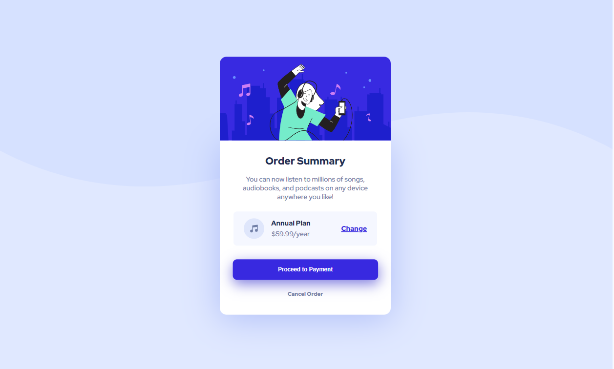

# Frontend Mentor - Order summary card solution

This is a solution to the [Order summary card challenge on Frontend Mentor](https://www.frontendmentor.io/challenges/order-summary-component-QlPmajDUj). Frontend Mentor challenges help you improve your coding skills by building realistic projects. 

## Table of contents

- [Overview](#overview)
  - [The challenge](#the-challenge)
  - [Screenshot](#screenshot)
  - [Links](#links)
- [My process](#my-process)
  - [Built with](#built-with)
  - [What I learned](#what-i-learned)
- [Author](#author)

## Overview

### The challenge

Users should be able to:

- See hover states for interactive elements

### Screenshot



### Links

- Solution URL: [Solution](https://github.com/melissabo94/order-summary-component)
- Live Site URL: [Live Site](https://melissabo94.github.io/order-summary-component/)

## My process

### Built with

- Semantic HTML5 markup
- CSS custom properties
- Flexbox

### What I learned

```css
box-shadow: 0px 10px 80px hsl(228, 84%, 83%);
```

## Author

- LinkedIn - [Melissa Borgnino](https://www.linkedin.com/in/melissa-borgnino-909712198/)
- Frontend Mentor - [@melissabo94](https://www.frontendmentor.io/profile/melissabo94)
